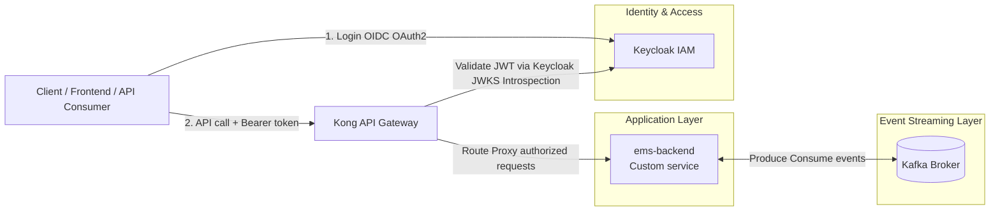

# Energy Management System (E3)

Currently in very early development. This repository will host the backend Go service and eventually the frontend dashboard of the Energy Management System. 

## Project Structure
- `backend/` Go backend service
- `docker-compose.yml` Local container orchestration
- `frontend/` Next.js frontend dashboard UI

## Architecture Diagram



## Quick Start - Backend

Install air for hot reload
```bash
go install github.com/air-verse/air@latest
```
Run the backend with air from the repo root
```bash
air -c backend/.air.toml
```

## Build and Run
From repo root:

```bash
docker compose up -d
```

Service will be exposed at `http://localhost:8080`.

## Stop Services
From repo root:
```bash
docker compose down
```

## Run Tests
From `backend/`:

```bash
go test ./...
```

## Run mock kafka producer
From `backend/`

```bash
go run cmd/misc/kafka_producer.go
```

## API Quick Check

```bash
curl http://localhost:8080/
curl http://localhost:8080/health/node_1
curl http://localhost:8080/nodes
```

## Notes
- Current data is in-memory seed data for development/testing.
- Future work will plug in database integration and Kafka/MQTT brokers as needed.
- API endpoints and data models are subject to change as the project evolves.
