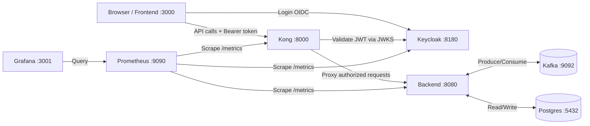

# EMS Full Architecture Setup Guide

> **Goal**: Wire up your existing EMS app into the full production-like architecture:
> `Frontend → Kong → Backend → Kafka/Postgres` with `Keycloak` for auth and `Prometheus + Grafana` for monitoring.

## What You Have Now (Current State)

| Component | Status | Details |
|-----------|--------|---------|
| **Frontend** | ✅ Working | Next.js 16, static export, talks directly to backend `:8080` |
| **Backend** | ✅ Working | Go 1.26, Kafka consumer, WebSocket hub, Postgres, REST API on `:8080` |
| **Kong** | ⚠️ Partial | Exists with basic-auth, needs JWT/OIDC via Keycloak |
| **Keycloak** | ❌ Missing | Not configured yet |
| **Prometheus** | ❌ Missing | Not configured yet |
| **Grafana** | ❌ Missing | Not configured yet |

## Architecture After Setup



---

## Step-by-Step Plan

### Step 1: Add Keycloak to Docker Compose

Add Keycloak container with a dev database (using the existing Postgres or its own embedded H2 DB for simplicity).

#### [MODIFY] [docker-compose.yml](file:///media/sangeeth/storage/E3-sem4-project/ems-app/docker-compose.yml)

Add these new services after the existing `kong` service:

```yaml
  keycloak:
    image: quay.io/keycloak/keycloak:26.0
    command: start-dev --import-realm
    environment:
      KC_BOOTSTRAP_ADMIN_USERNAME: admin
      KC_BOOTSTRAP_ADMIN_PASSWORD: admin
      KC_HTTP_PORT: 8180
      KC_HEALTH_ENABLED: "true"
      KC_METRICS_ENABLED: "true"
    ports:
      - "8180:8180"
    volumes:
      - ./keycloak:/opt/keycloak/data/import
    healthcheck:
      test: ["CMD-SHELL", "exec 3<>/dev/tcp/127.0.0.1/8180; echo -e 'GET /health/ready HTTP/1.1\r\nHost: localhost\r\n\r\n' >&3; timeout 1 cat <&3 | grep -q '200'"]
      interval: 10s
      timeout: 5s
      retries: 12
      start_period: 30s
```

> [!NOTE]
> `start-dev` uses embedded H2 DB — no extra Postgres needed for Keycloak. For production, you'd use a separate Postgres DB.

---

### Step 2: Create Keycloak Realm Config

Create a realm export file so Keycloak auto-configures on startup.

#### [NEW] `keycloak/ems-realm.json`

This JSON file will define:
- A realm called `ems`
- A client called `ems-frontend` (public, for the SPA)
- A client called `ems-backend` (confidential, for backend service-to-service)
- Default roles: `admin`, `operator`, `viewer`
- A test user: `demo / demo123`

> [!IMPORTANT]
> **Question**: What roles do you want? I suggest `admin`, `operator`, `viewer`. Should I create specific test users? For now, I'll create one `demo` user with `admin` role.

---

### Step 3: Update Kong to Use JWT (via Keycloak JWKS)

Replace the current `basic-auth` plugin with the `openid-connect` or `jwt` plugin that validates tokens against Keycloak's JWKS endpoint.

#### [MODIFY] [kong.yml](file:///media/sangeeth/storage/E3-sem4-project/ems-app/kong/kong.yml)

Replace `basic-auth` with `jwt` plugin:

```yaml
_format_version: "3.0"
_transform: true

services:
  - name: ems-backend-ws
    url: http://ems-backend:8080/api/v1/readings
    routes:
      - name: ems-ws
        paths:
          - /api/readings
        strip_path: true
        # No JWT here to allow browser WebSocket connections
        # (WS auth is handled differently - token in query param or first message)

  - name: ems-backend
    url: http://ems-backend:8080
    routes:
      - name: ems-api
        paths:
          - /api
        strip_path: true
        plugins:
          - name: jwt
            config:
              uri_param_names:
                - jwt
              claims_to_verify:
                - exp

plugins:
  - name: cors
    config:
      origins:
        - "*"
      methods:
        - GET
        - POST
        - PUT
        - DELETE
        - PATCH
        - OPTIONS
      headers:
        - Accept
        - Content-Length
        - Content-Type
        - Authorization
      exposed_headers:
        - X-Auth-Token
      credentials: true
      max_age: 3600

  - name: rate-limiting
    config:
      second: 5
      hour: 10000
      policy: local

  - name: prometheus
    config: {}

# JWT consumer configuration (populated from Keycloak JWKS)
consumers:
  - username: keycloak-service
    jwt_secrets:
      - algorithm: RS256
        key: http://keycloak:8180/realms/ems
        secret: ""  # Not needed for RS256 - uses JWKS
```

> [!WARNING]
> Kong OSS (open-source) has the `jwt` plugin but **not** `openid-connect` (that's Kong Enterprise/Konnect only). So we use the `jwt` plugin with Keycloak's JWKS endpoint. An alternative is to **validate the JWT in your Go backend middleware** — simpler and free. I recommend this approach below.

> [!IMPORTANT]  
> **Simpler Alternative (Recommended)**: Instead of Kong JWT plugin (which is tricky with Keycloak RS256), keep Kong as a plain reverse proxy + rate limiter + CORS handler, and **add JWT validation middleware in your Go backend**. This is much easier. Do you prefer this approach?

---

### Step 4: Add Prometheus & Grafana to Docker Compose

#### [MODIFY] [docker-compose.yml](file:///media/sangeeth/storage/E3-sem4-project/ems-app/docker-compose.yml)

Add these services:

```yaml
  prometheus:
    image: prom/prometheus:v3.4.0
    volumes:
      - ./prometheus/prometheus.yml:/etc/prometheus/prometheus.yml
      - prometheus_data:/prometheus
    ports:
      - "9090:9090"
    command:
      - '--config.file=/etc/prometheus/prometheus.yml'
      - '--storage.tsdb.retention.time=15d'

  grafana:
    image: grafana/grafana:11.6.0
    environment:
      GF_SECURITY_ADMIN_USER: admin
      GF_SECURITY_ADMIN_PASSWORD: admin
      GF_SERVER_HTTP_PORT: "3001"
    ports:
      - "3001:3001"
    volumes:
      - grafana_data:/var/lib/grafana
      - ./grafana/provisioning:/etc/grafana/provisioning
    depends_on:
      - prometheus
```

Add to `volumes:` section:
```yaml
  prometheus_data:
  grafana_data:
```

#### [NEW] `prometheus/prometheus.yml`

```yaml
global:
  scrape_interval: 15s
  evaluation_interval: 15s

scrape_configs:
  - job_name: 'ems-backend'
    static_configs:
      - targets: ['ems-backend:8080']
    metrics_path: /metrics

  - job_name: 'kong'
    static_configs:
      - targets: ['kong:8001']
    metrics_path: /metrics

  - job_name: 'keycloak'
    static_configs:
      - targets: ['keycloak:8180']
    metrics_path: /metrics
```

#### [NEW] `grafana/provisioning/datasources/prometheus.yml`

```yaml
apiVersion: 1
datasources:
  - name: Prometheus
    type: prometheus
    access: proxy
    url: http://prometheus:9090
    isDefault: true
    editable: true
```

---

### Step 5: Add `/metrics` Endpoint to Backend

Your Go backend needs a `/metrics` endpoint for Prometheus to scrape.

#### [MODIFY] Backend - Add a Prometheus metrics handler

**Option A (Zero dependencies — simplest)**:
Add a simple `/metrics` endpoint in your routes that returns basic metrics in Prometheus text format.

**Option B (Standard — recommended)**:
Add the `promhttp` package from the official Prometheus Go client.

Changes needed:

1. Add dependency: `go get github.com/prometheus/client_golang/prometheus/promhttp`
2. Add route in [routes.go](file:///media/sangeeth/storage/E3-sem4-project/ems-app/backend/internal/routes/routes.go):
   ```go
   router.Handle("GET /metrics", promhttp.Handler())
   ```
3. Add custom metrics (request count, latency, WebSocket connections) in middleware.

---

### Step 6: Add Frontend → Kong Flow (Update API URLs)

Currently, your frontend talks directly to `backend:8080`. It needs to go through Kong on `:8000` instead.

#### [MODIFY] [realtime-dashboard.tsx](file:///media/sangeeth/storage/E3-sem4-project/ems-app/frontend/app/components/realtime-dashboard.tsx)

Change the API target from backend directly to Kong:

```tsx
// BEFORE
const BACKEND_PORT = 8080;

// AFTER  
const API_PORT = 8000;  // Kong gateway port
```

And add JWT token in the `Authorization` header for API calls (from Keycloak login).

---

### Step 7: Add Keycloak Login Flow to Frontend

Add a simple Keycloak login flow using `keycloak-js` SDK or manual OIDC.

#### Option A: `keycloak-js` (simplest)
```bash
cd frontend && npm install keycloak-js
```

Create an auth wrapper component that:
1. Redirects to Keycloak login page
2. Receives the JWT token after login
3. Stores token in memory
4. Attaches token to all API requests

#### Option B: Manual OIDC (no extra dependency)
Use the standard OIDC authorization code flow with PKCE directly.

---

## Summary of All Files to Create/Modify

| Action | File | Purpose |
|--------|------|---------|
| **MODIFY** | `docker-compose.yml` | Add Keycloak, Prometheus, Grafana services |
| **NEW** | `keycloak/ems-realm.json` | Keycloak realm auto-import config |
| **MODIFY** | `kong/kong.yml` | Remove basic-auth, add Prometheus plugin |
| **NEW** | `prometheus/prometheus.yml` | Prometheus scrape config |
| **NEW** | `grafana/provisioning/datasources/prometheus.yml` | Auto-provision Prometheus datasource |
| **MODIFY** | `backend/go.mod` | Add `prometheus/client_golang` |
| **MODIFY** | `backend/internal/routes/routes.go` | Add `/metrics` endpoint |
| **MODIFY** | `backend/internal/middleware/middleware.go` | Add JWT validation middleware |
| **MODIFY** | `frontend/package.json` | Add `keycloak-js` |
| **MODIFY** | `frontend/app/components/realtime-dashboard.tsx` | Route API through Kong, add auth headers |
| **NEW** | `frontend/app/components/auth-provider.tsx` | Keycloak auth wrapper |

---

## Open Questions

> [!IMPORTANT]
> **1. JWT Validation Location**: Do you want JWT validation in **Kong** (requires careful JWKS setup) or in the **Go backend** (simpler, add a middleware)? I recommend the backend approach — it's simpler and you have full control.

> [!IMPORTANT]
> **2. Frontend Auth Approach**: Do you want to use `keycloak-js` SDK (easiest, adds ~50KB) or manual OIDC flow (no dependency, more code)?

> [!IMPORTANT]  
> **3. Grafana Dashboards**: Should I create pre-built dashboard JSON files for Grafana (showing request rate, error rate, latency, WebSocket connections, Kafka lag)? Or do you prefer to build dashboards manually in the Grafana UI?

> [!IMPORTANT]
> **4. Kong's role**: With Keycloak + backend JWT middleware, Kong would just do **rate limiting + CORS + reverse proxy + Prometheus metrics**. No auth in Kong itself. Is that acceptable?

---

## Verification Plan

### Automated Tests
1. `docker compose up -d` — all 8 services start healthy
2. `curl http://localhost:8180/realms/ems` — Keycloak realm exists
3. Get a token: `curl -X POST http://localhost:8180/realms/ems/protocol/openid-connect/token -d "grant_type=password&client_id=ems-frontend&username=demo&password=demo123"` 
4. Call API through Kong with token: `curl -H "Authorization: Bearer $TOKEN" http://localhost:8000/api/v1/health`
5. `curl http://localhost:8080/metrics` — Prometheus metrics exposed
6. `curl http://localhost:9090/api/v1/targets` — all scrape targets UP
7. Open `http://localhost:3001` — Grafana loads with Prometheus datasource

### Manual Verification
- Open `http://localhost:3000` — Frontend redirects to Keycloak login
- Login with `demo/demo123` → redirected back to dashboard
- Dashboard shows live data through Kong
- Grafana at `http://localhost:3001` shows metrics
