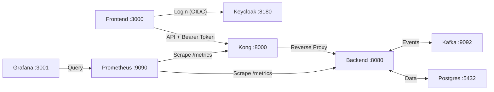

# EMS Full Architecture Setup — Walkthrough

## Summary

Set up the complete EMS architecture with 8 services: Frontend, Kong, Keycloak, Backend, Kafka, Postgres, Prometheus, and Grafana.

## Architecture



## Port Map

| Service | Port | URL |
|---------|------|-----|
| Frontend | 3000 | http://localhost:3000 |
| Kong Proxy | 8000 | http://localhost:8000 |
| Kong Admin | 8001 | http://localhost:8001 |
| Backend | 8080 | http://localhost:8080 |
| Keycloak | 8180 | http://localhost:8180 |
| Prometheus | 9090 | http://localhost:9090 |
| Grafana | 3001 | http://localhost:3001 |
| Kafka | 9092 | localhost:9092 |
| Postgres | 5432 | localhost:5432 |

## Test Credentials

| Service | Username | Password |
|---------|----------|----------|
| Keycloak Admin Console | admin | admin |
| EMS Demo User | demo | demo123 |
| EMS Viewer User | viewer | viewer123 |
| Grafana | admin | admin |

---

## New Files Created

### [keycloak/ems-realm.json](file:///media/sangeeth/storage/E3-sem4-project/ems-app/keycloak/ems-realm.json)
Keycloak realm auto-import config:
- Realm: `ems`
- Public client: `ems-frontend` (PKCE-enabled SPA client)
- Confidential client: `ems-backend`
- Roles: `admin`, `operator`, `viewer`
- Users: `demo` (all roles), `viewer` (viewer only)

### [prometheus/prometheus.yml](file:///media/sangeeth/storage/E3-sem4-project/ems-app/prometheus/prometheus.yml)
Scrape config targeting:
- `ems-backend:8080/metrics`
- `kong:8001/metrics`
- `keycloak:8180/realms/ems/metrics`

### [grafana/provisioning/datasources/prometheus.yml](file:///media/sangeeth/storage/E3-sem4-project/ems-app/grafana/provisioning/datasources/prometheus.yml)
Auto-provisions Prometheus as default Grafana datasource on startup.

### [backend/internal/middleware/metrics.go](file:///media/sangeeth/storage/E3-sem4-project/ems-app/backend/internal/middleware/metrics.go)
Prometheus metrics middleware:
- `ems_http_requests_total` — counter by method/path/status
- `ems_http_request_duration_seconds` — histogram
- `ems_websocket_active_connections` — gauge

### [backend/internal/middleware/jwt.go](file:///media/sangeeth/storage/E3-sem4-project/ems-app/backend/internal/middleware/jwt.go)
JWT validation middleware:
- Fetches Keycloak JWKS keys (cached with 10-min TTL)
- Validates RS256 signature, expiry, and issuer
- Skip paths: `/`, `/metrics`, `/api/v1/health`, `/api/v1/readings` (WebSocket)
- Attaches claims to request context

### [frontend/app/components/auth-provider.tsx](file:///media/sangeeth/storage/E3-sem4-project/ems-app/frontend/app/components/auth-provider.tsx)
Keycloak auth provider:
- `login-required` mode (auto-redirects to Keycloak login)
- PKCE (S256) enabled
- Auto token refresh every 30s
- Exposes `useAuth()` hook with `token`, `username`, `roles`, `login`, `logout`

---

## Modified Files

### [docker-compose.yml](file:///media/sangeeth/storage/E3-sem4-project/ems-app/docker-compose.yml)
```diff:docker-compose.yml
services:
  ems-backend:
    depends_on:
      db:
        condition: service_healthy
    build:
      context: ./backend
      target: dev-stage
    # Mount local folder for hot-reloading
    volumes:
      - ./backend:/app
    environment:
      KAFKA_BROKER: broker:29092
      POSTGRES_URL: postgres://user:password@db:5432/ems_db?sslmode=disable
      POSTGRES_HOST: db
      POSTGRES_PORT: "5432"
      POSTGRES_USER: user
      POSTGRES_PASSWORD: password
      POSTGRES_DB: ems_db
      POSTGRES_SSLMODE: disable
    command: ["go", "run", "./cmd/backend"]
    ports:
      - 8080:8080

  db:
    image: postgres:15-alpine
    restart: always
    environment:
      POSTGRES_USER: user
      POSTGRES_PASSWORD: password
      POSTGRES_DB: ems_db
    ports:
      - "5432:5432"
    healthcheck:
      test: ["CMD-SHELL", "pg_isready -U user -d ems_db"]
      interval: 5s
      timeout: 5s
      retries: 5
    volumes:
      - postgres_data:/var/lib/postgresql/data
      - ./db/postgres/seed.sql:/docker-entrypoint-initdb.d/seed.sql

  kong:
    image: kong:3.4.0
    volumes:
      - ./kong:/usr/local/kong/declarative
    environment:
      KONG_DATABASE: "off"
      KONG_DECLARATIVE_CONFIG: /usr/local/kong/declarative/kong.yml
      KONG_PROXY_ACCESS_LOG: /dev/stdout
      KONG_ADMIN_ACCESS_LOG: /dev/stdout
      KONG_PROXY_ERROR_LOG: /dev/stderr
      KONG_ADMIN_ERROR_LOG: /dev/stderr
      KONG_ADMIN_LISTEN: 0.0.0.0:8001, 0.0.0.0:8444 ssl
    ports:
      - "8000:8000"
      - "8001:8001"
      - "8443:8443"
      - "8444:8444"

  broker:
    image: apache/kafka:4.2.0
    hostname: broker
    container_name: broker
    ports:
      - "9092:9092"
    environment:
      KAFKA_BROKER_ID: 1
      KAFKA_LISTENER_SECURITY_PROTOCOL_MAP: PLAINTEXT:PLAINTEXT,PLAINTEXT_HOST:PLAINTEXT,CONTROLLER:PLAINTEXT
      KAFKA_ADVERTISED_LISTENERS: PLAINTEXT://broker:29092,PLAINTEXT_HOST://localhost:9092
      KAFKA_OFFSETS_TOPIC_REPLICATION_FACTOR: 1
      KAFKA_GROUP_INITIAL_REBALANCE_DELAY_MS: 0
      KAFKA_TRANSACTION_STATE_LOG_MIN_ISR: 1
      KAFKA_TRANSACTION_STATE_LOG_REPLICATION_FACTOR: 1
      KAFKA_PROCESS_ROLES: broker,controller
      KAFKA_NODE_ID: 1
      KAFKA_CONTROLLER_QUORUM_VOTERS: 1@broker:29093
      KAFKA_LISTENERS: PLAINTEXT://broker:29092,CONTROLLER://broker:29093,PLAINTEXT_HOST://0.0.0.0:9092
      KAFKA_INTER_BROKER_LISTENER_NAME: PLAINTEXT
      KAFKA_CONTROLLER_LISTENER_NAMES: CONTROLLER
      KAFKA_LOG_DIRS: /tmp/kraft-combined-logs
      CLUSTER_ID: MkU3OEVBNTcwNTJENDM2Qk
    healthcheck:
      test: ["CMD-SHELL", "/opt/kafka/bin/kafka-topics.sh --bootstrap-server localhost:9092 --list || exit 1"]
      interval: 10s
      timeout: 5s
      retries: 8
      start_period: 20s

volumes:
  postgres_data:
===
services:
  ems-backend:
    depends_on:
      db:
        condition: service_healthy
    build:
      context: ./backend
      target: dev-stage
    # Mount local folder for hot-reloading
    volumes:
      - ./backend:/app
    environment:
      KAFKA_BROKER: broker:29092
      POSTGRES_URL: postgres://user:password@db:5432/ems_db?sslmode=disable
      POSTGRES_HOST: db
      POSTGRES_PORT: "5432"
      POSTGRES_USER: user
      POSTGRES_PASSWORD: password
      POSTGRES_DB: ems_db
      POSTGRES_SSLMODE: disable
      KEYCLOAK_ISSUER: http://keycloak:8180/realms/ems
    command: ["go", "run", "./cmd/backend"]
    ports:
      - 8080:8080

  db:
    image: postgres:15-alpine
    restart: always
    environment:
      POSTGRES_USER: user
      POSTGRES_PASSWORD: password
      POSTGRES_DB: ems_db
    ports:
      - "5432:5432"
    healthcheck:
      test: ["CMD-SHELL", "pg_isready -U user -d ems_db"]
      interval: 5s
      timeout: 5s
      retries: 5
    volumes:
      - postgres_data:/var/lib/postgresql/data
      - ./db/postgres/seed.sql:/docker-entrypoint-initdb.d/seed.sql

  kong:
    image: kong:3.4.0
    volumes:
      - ./kong:/usr/local/kong/declarative
    environment:
      KONG_DATABASE: "off"
      KONG_DECLARATIVE_CONFIG: /usr/local/kong/declarative/kong.yml
      KONG_PROXY_ACCESS_LOG: /dev/stdout
      KONG_ADMIN_ACCESS_LOG: /dev/stdout
      KONG_PROXY_ERROR_LOG: /dev/stderr
      KONG_ADMIN_ERROR_LOG: /dev/stderr
      KONG_ADMIN_LISTEN: 0.0.0.0:8001, 0.0.0.0:8444 ssl
    ports:
      - "8000:8000"
      - "8001:8001"
      - "8443:8443"
      - "8444:8444"

  keycloak:
    image: quay.io/keycloak/keycloak:26.0
    command: start-dev --import-realm
    environment:
      KC_BOOTSTRAP_ADMIN_USERNAME: admin
      KC_BOOTSTRAP_ADMIN_PASSWORD: admin
      KC_HTTP_PORT: 8180
      KC_HEALTH_ENABLED: "true"
      KC_METRICS_ENABLED: "true"
    ports:
      - "8180:8180"
    volumes:
      - ./keycloak:/opt/keycloak/data/import
    healthcheck:
      test: ["CMD-SHELL", "exec 3<>/dev/tcp/127.0.0.1/8180 && echo -e 'GET /health/ready HTTP/1.1\r\nHost: localhost\r\nConnection: close\r\n\r\n' >&3 && timeout 2 cat <&3 | grep -q 'UP'"]
      interval: 15s
      timeout: 10s
      retries: 15
      start_period: 60s

  broker:
    image: apache/kafka:4.2.0
    hostname: broker
    container_name: broker
    ports:
      - "9092:9092"
    environment:
      KAFKA_BROKER_ID: 1
      KAFKA_LISTENER_SECURITY_PROTOCOL_MAP: PLAINTEXT:PLAINTEXT,PLAINTEXT_HOST:PLAINTEXT,CONTROLLER:PLAINTEXT
      KAFKA_ADVERTISED_LISTENERS: PLAINTEXT://broker:29092,PLAINTEXT_HOST://localhost:9092
      KAFKA_OFFSETS_TOPIC_REPLICATION_FACTOR: 1
      KAFKA_GROUP_INITIAL_REBALANCE_DELAY_MS: 0
      KAFKA_TRANSACTION_STATE_LOG_MIN_ISR: 1
      KAFKA_TRANSACTION_STATE_LOG_REPLICATION_FACTOR: 1
      KAFKA_PROCESS_ROLES: broker,controller
      KAFKA_NODE_ID: 1
      KAFKA_CONTROLLER_QUORUM_VOTERS: 1@broker:29093
      KAFKA_LISTENERS: PLAINTEXT://broker:29092,CONTROLLER://broker:29093,PLAINTEXT_HOST://0.0.0.0:9092
      KAFKA_INTER_BROKER_LISTENER_NAME: PLAINTEXT
      KAFKA_CONTROLLER_LISTENER_NAMES: CONTROLLER
      KAFKA_LOG_DIRS: /tmp/kraft-combined-logs
      CLUSTER_ID: MkU3OEVBNTcwNTJENDM2Qk
    healthcheck:
      test: ["CMD-SHELL", "/opt/kafka/bin/kafka-topics.sh --bootstrap-server localhost:9092 --list || exit 1"]
      interval: 10s
      timeout: 5s
      retries: 8
      start_period: 20s

  prometheus:
    image: prom/prometheus:v3.4.0
    volumes:
      - ./prometheus/prometheus.yml:/etc/prometheus/prometheus.yml
      - prometheus_data:/prometheus
    ports:
      - "9090:9090"
    command:
      - '--config.file=/etc/prometheus/prometheus.yml'
      - '--storage.tsdb.retention.time=15d'

  grafana:
    image: grafana/grafana:11.6.0
    environment:
      GF_SECURITY_ADMIN_USER: admin
      GF_SECURITY_ADMIN_PASSWORD: admin
      GF_SERVER_HTTP_PORT: "3001"
    ports:
      - "3001:3001"
    volumes:
      - grafana_data:/var/lib/grafana
      - ./grafana/provisioning:/etc/grafana/provisioning
    depends_on:
      - prometheus

volumes:
  postgres_data:
  prometheus_data:
  grafana_data:
```

### [kong/kong.yml](file:///media/sangeeth/storage/E3-sem4-project/ems-app/kong/kong.yml)
- Removed `basic-auth` plugin and `consumers` with passwords
- Added `prometheus` plugin for Kong metrics
- Kong now acts as: reverse proxy + rate limiter + CORS handler

### [backend/internal/config/config.go](file:///media/sangeeth/storage/E3-sem4-project/ems-app/backend/internal/config/config.go)
- Added `KeycloakIssuer` field (reads `KEYCLOAK_ISSUER` env var)

### [backend/internal/app/app.go](file:///media/sangeeth/storage/E3-sem4-project/ems-app/backend/internal/app/app.go)
- Added `PrometheusMiddleware()` and `JWTMiddleware()` to the handler chain

### [backend/internal/routes/routes.go](file:///media/sangeeth/storage/E3-sem4-project/ems-app/backend/internal/routes/routes.go)
- Added `GET /metrics` route (Prometheus handler)
- Added WebSocket connection gauge tracking (inc/dec)

### [frontend/app/layout.tsx](file:///media/sangeeth/storage/E3-sem4-project/ems-app/frontend/app/layout.tsx)
- Wrapped `{children}` with `<AuthProvider>` for Keycloak auth

### [frontend/app/components/realtime-dashboard.tsx](file:///media/sangeeth/storage/E3-sem4-project/ems-app/frontend/app/components/realtime-dashboard.tsx)
- API calls now go through Kong (port 8000) instead of backend (port 8080)
- Added `Authorization: Bearer <token>` header to all fetch calls
- Replaced "Settings" button with username badge + "Logout" button

### [frontend/app/globals.css](file:///media/sangeeth/storage/E3-sem4-project/ems-app/frontend/app/globals.css)
- Added `.userBadge` CSS class

---

## Verification

| Check | Result |
|-------|--------|
| Go backend `go build ./...` | ✅ Compiles |
| Go tests `go test ./...` | ✅ All pass |
| Frontend `next build` | ✅ Builds (5 static pages) |

## How to Run

```bash
# Start all services
docker compose up -d

# Wait for Keycloak to be healthy (~60s on first run)
docker compose logs -f keycloak

# Run frontend dev server
cd frontend && npm run dev

# Open http://localhost:3000 → redirects to Keycloak login
# Login: demo / demo123

# Check Prometheus targets
open http://localhost:9090/targets

# Check Grafana
open http://localhost:3001  # admin / admin
```
